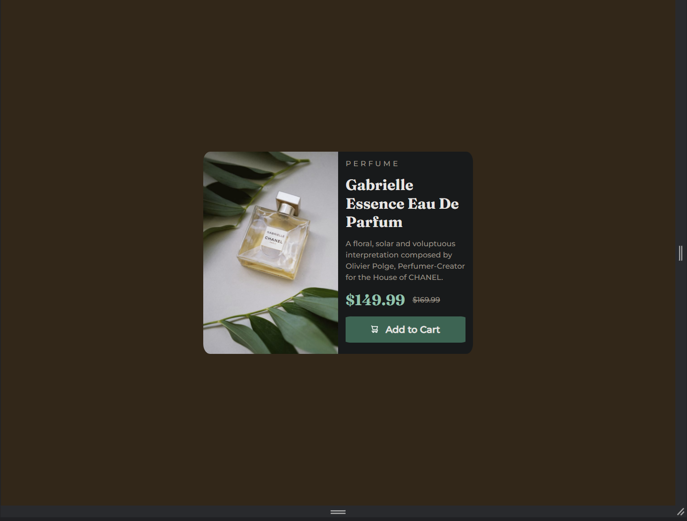

# Frontend Mentor - Product preview card component solution

This is a solution to the [Product preview card component challenge on Frontend Mentor](https://www.frontendmentor.io/challenges/product-preview-card-component-GO7UmttRfa). Frontend Mentor challenges help you improve your coding skills by building realistic projects. 

### The challenge

Users should be able to:

- View the optimal layout depending on their device's screen size
- See hover and focus states for interactive elements

### Screenshot

### Links

- Solution URL: [Github Repo](https://github.com/uruskan/product-preview-card-component-main)
- Live Site URL: [Live Site](https://uruskan.github.io/product-preview-card-component-main/)

## My process

### Built with

- Semantic HTML5 markup
- CSS custom properties
- Flexbox
- Mobile-first workflow

### What I learned

I am still having some problems with the responsive heights but other than that this was quite easy.

## Author

- Website - [Umut Piynar](https://github.com/uruskan)
- Frontend Mentor - [@uruskan](https://www.frontendmentor.io/profile/uruskan)

